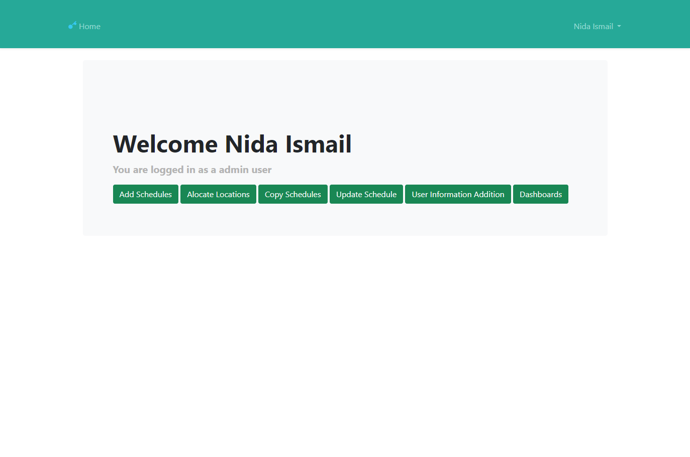

# Employee Scheduling System

This is the project to create manage and monitor employee schedules in an organisation. The application enables an employee to add schedules view schedules and edit schedules. Moreover, the application enables the admins to view and monitor overall campus activity in different dashboards. 

## Table of contents

- [Screenshot](#screenshot)
- [Links](#links)
- [My process](#my-process)
  - [Built with](#built-with)
  - [What I learned](#what-i-learned)
- [Author](#author)

### Screenshot

### Links

- Solution URL: [Github](https://github.com/nidaismail/Scheduler)
- Live Site URL: [Cloud](https://scheduler.imdcollege.edu.pk/)

## My process

The project is made using laravel, firstly i set up all the view files then the controller files then models along with the tables in mySQL.

### Built with

- PHP (Laravel)
- HTML
- CSS
- JS
- JSON
- MySQL
  
### What I learned
This was my first project with laravel

## Author

- Nida Ismail
