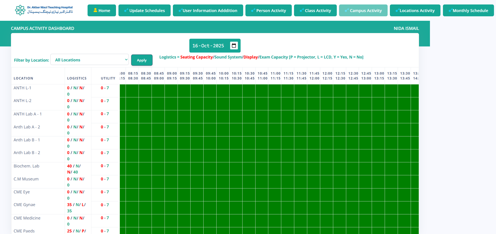

# Scheduler App (Version II of Schedular) 

The is a project to add, edit, delete, view and manage employee schedules of an organisations.

## Table of contents

- [Screenshot](#screenshot)
- [Links](#links)
- [My process](#my-process)
  - [Built with](#built-with)
  - [What I learned](#what-i-learned)
- [Author](#author)

### Screenshot

### Links

- Solution URL: [Github](https://github.com/nidaismail/Scheduler)
- Live Demo: [Scheduler](https://scheduler.imdcollege.edu.pk/)

## My process

The project is made using laravel, so i started with the view files then the controller functions and the tables in MYSQL and along with model files.

### Built with

- PHP (Laravel)
- HTML
- CSS custom properties
- MYSQL

### What I learned

## Author

- Nida Ismail
